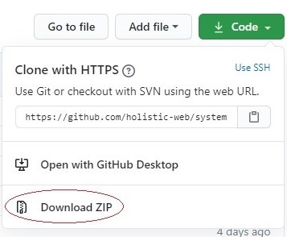
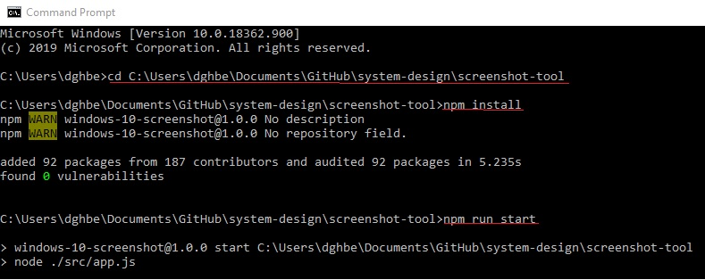

# System Design Website

A tool to capture screenshots from a given livestream and have these shown on a static website. These images will update live in front of the user every 5 seconds. The screenshots are taken with the npm screenshot tool, stored in AWS S3 with Pusher notifications being sent telling the site to update the image.

## Using this tool

### 1. Install Node js from https://nodejs.org/en/download/ (if not already installed)

### 2. Download and unzip the code for this project as a ZIP from this page:

 

### 3. Place the provided .env file you have been given in the system-design/screenshot-tool folder.

### 4. Install and run the code using the following steps:

a. Open a terminal. For instructions on how look here: https://www.wikihow.com/Open-Terminal-in-Windows

b. Go to the screenshot-tool folder by typing 'cd ' followed by the location of the screenshot-tool e.g. 'cd C:\example\system-design\screenshot-tool'

c. Install dependencies by typing 'npm install' (you will only have to do this once).

d. Run the code in the terminal by typing 'npm run start'

### 6. A screenshot of your desktop will now be taken every 5 seconds and hosted at the url http://system-design-hosting.s3-website.ap-east-1.amazonaws.com/
